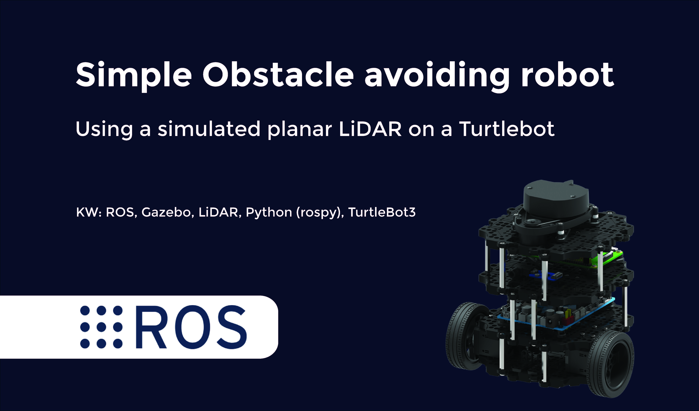
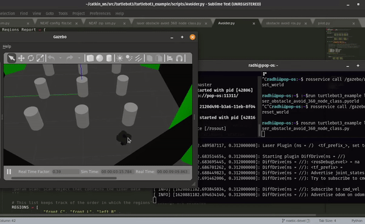
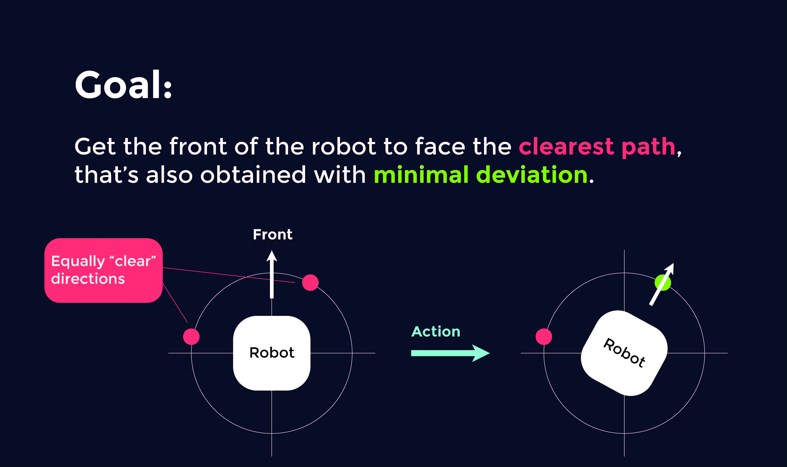
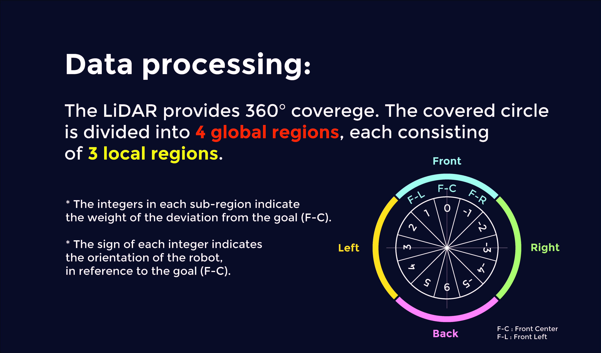

# Code a "naive" obstacle avoiding robot in ROS

> [YOUTUBE VIDEO](https://youtu.be/5L95R6ePKqo)

---

## Description

This project was made as a practice for basic ROS concepts such as ros-topics, subscribing, publishing, and simulating robots in Gazebo.
The goal was to make a robot:

- Read data from the 360° LiDAR scanner.

- Process the data in order to find the clearest path (will talk about this in more details down below).

- Steer the robot into the right direction.

> Quick running demo

### Technologies used

- Ubuntu distro : 18.04 LTS (tested on Pop!OS too)

- ROS distro: Melodic (tested on Noetic too)

- Gazebo version : 9+

- Python: rospy

---

## Disclamer

This article assumes having basic knowledge of ROS, Python, Gazebo, LiDARs, and Linux, since these will not be covered here.

#### Get started with ROS

If you want to get started with ROS, read this [doc](https://docs.google.com/document/d/1VXA88LlZBkRv_2Z2--jHAbQZDKCOZ0l3LTyKR5cDM5o/edit?usp=sharing).

---

## Data processing for finding the cleares path

### What's a "clearest path"?

The clearest path is the direction in which the distance to the nearest object is larger than the threshhold defined in the code.This threshhold is introduced so that the robot would know which objects to consider as obstacles and which to ignore. The threshhold in this project is defined to be 0.5 meter (it depends on the environment the robot will operate in, and the size of the robot, along with some other factors)

### Criteria for choosing between multiple clear paths

In this approach, I decided that if mutiple paths are equally clear, the robot shall face the path that'll be reached with minimal movement, this approach is illustrated in the picture down below.

### Reading the data from the sensor and acting upon it

The sensor provides 360° coverege with 360 points in each turn (a measured distance each 1°). I decided to split the covered circle into 4 global sections, each consisting of 3 local section. This allowed me to reduce the number of directions, the robot could go to, from 360 (each measured distance) to 12 with the 12 sections each presented by the closest object in that covered area (30° of covered range for each sub-section).
After getting the minimum of each section, we calculate the costs of deviating from our current position (which is always the central frontal section) to all the clear sections, pick the "cheapest" option, then we figure the sign of the angular velocity (has constant value) needed to reach that orientation using this formula:

##### (cost/|cost|) * ANGULAR_VELOCITY (returns positive angular_velocity if orientation is at left, negative otherwise).

~Then we need to specify the time needed to execute this rotation before getting back to walking in a straight line, for that we use this formula:~

~(|cost| * 30 * PI) / (180 * ANGULAR_VELOCITY) (the ANGULAR_VELOCITY is in *radians/second*, and 3.14\[radian] = PI\[radian] = 180\[degree]).~

**The sleep approach was blocking the code in many cases and resulted in the robot being stuck in between obstacles, I updated it with a non blocking `do{ .. }while()` approach (there's no do{ .. }while() in python, just adopted the principle from the beloved C).**

**EDIT: I rewrote the code in an OOP approach for better portability, hence now no sleep/do-while approach is needed.**

Once we get the sign of the angular velocity~, and for how long we'll need to execute it~, we send this data to the robot and *voila*, obstacle avoided. 

The data processing approach is illustrated in the picture down below.

---

## How to use

As with all ROS nodes, you'll need the node to be placed inside a package before running it, so copy the node file into any existing package you have, or create its own package for it. Once you have the file in your machine, you'll need to run the TurtleBot sumulation (you can run this code with any robot that's using the *Twist* message under the */cmd_vel* topic, just make sure you adjust the obstacle threshhold along with the other key parameters), then you can launch the code and watch your robot dodge all obstacles around it.

---

## References

- If you want to get started with ROS, you can check [this doc](https://docs.google.com/document/d/1VXA88LlZBkRv_2Z2--jHAbQZDKCOZ0l3LTyKR5cDM5o/edit?usp=sharing) I created as a documentation to my journey of learning ROS.

- This YouTube [playlist](https://www.youtube.com/playlist?list=PLn8PRpmsu08rLRGrnF-S6TyGrmcA2X7kg) explains beautifully autonomous navigation if you want to explore more further this field.

---

## Author info

[Linkedin](https://www.linkedin.com/in/radhi-sghaier/)

